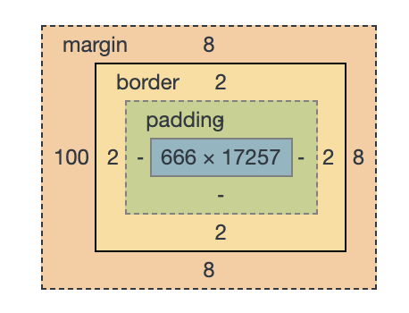

# CSS笔记

## 形式
有3种形式：

* 内联式,eg:`<p style="color:red">这里文字是红色。</p>`
* 嵌入式css样式,一般情况下嵌入式css样式写在`<head></head> `之间。eg:
```css
<style type="text/css">
span{
color:red;
}
</style>
```
* 外部式css样式,就是把css代码写一个单独的外部文件中(*.css)。在`<head>`内

```css
<link href="base.css" rel="stylesheet" type="text/css" />
```

3种形式的优先级：内联式 > 嵌入式 > 外部式，（就近原则）

## 选择器

### 标签选择器

html中的标签如`<html>、<body>、<h1>、<p>、`，`p{font-size:12px;line-height:1.6em;}`。

### 类选择器

类选择器在css样式编码中是最常用。语法：`.类选器名称{css样式代码;}`，其中类选择器名称可以是任意名。

通过`class`进行指定使用，`<span class="demo_name"> hello </span>`

### ID选择器

ID选择器类似于类选择器（都可以应用在任何元素），但区别是：

* `id="demo_name"` vs `class="demo_name"`
* ID选择器前面是`#`

不同点包括：
* ID选择器只能使用一次，而类选择器可以使用多次
* 类选择器可以为一个元素设置多个样式，而ID选择器不可以
  
### 子选择器

用大于符号(>),用于选择指定标签元素的**第一代子元素**，如`.parent>li{border:1px solid red;}`

### 包含选择器

使用空格进行指定`.first  span{color:red;}`，作用于**所有后代元素**。

### 通用选择器

使用`*`进行指定所有的标签元素，`a:hover{color:red;}`

### 伪类选择符

给html不存在的标签（标签的某种状态）设置样式，如`a:hover{color:red;}`（划过变为红色）

### 分组选择符

如`h1,span{color:red;}`

## 特性

### 继承性

继承是指不仅应用到该标签下，而且在子标签下也生效（例如颜色）。但不是所有都会生效（如border属性不会生效）

### 特殊性

如果在同一个标签设置了多个不同的属性，如何显示呢？如：
```css
p{color:red;}
.first{color:green;}
<p class="first"> demo </p>
```
会显示green，因为是按照权重来的。标签的权值为1，类选择符的权值为10，ID选择符的权值最高为100。

### 层叠

若对于同一元素有多个css样式存在，当有相同权重的样式存在时，会根据这些css样式的前后顺序来决定（使用后面的）。

### 重要性

加入`!important`即可，如`p{color:red!important;}`。

## 属性

### 字体

`body{font-family:"宋体";}`

### 字号颜色

`body{font-size:12px;color:#666}`

### 粗体

`p span{font-weight:bold;}`

### 斜体

`p a{font-style:italic;}`

### 下划线

`p a{text-decoration:underline;}`

### 删除线

`.oldPrice{text-decoration:line-through;}`

### 缩进

`p{text-indent:2em;}`

### 行间距

`p{line-height:1.5em;}`

### 中文字间距、字母间距

`h1{letter-spacing:50px;}`

### 单词间距

`h1{word-spacing:50px;}`

### 对齐

`h1{text-align:center;}`

## css盒模型

html中标签元素被分成3种：块状元素、内联元素(又叫行内元素)和内联块状元素
* 块元素：`<div>、<p>、<h1>...<h6>、<ol>、<ul>、<dl>、<table>、<address>、<blockquote> 、<form>`
* 内联元素:`<a>、<span>、<br>、<i>、<em>、<strong>、<label>、<q>、<var>、<cite>、<code>`
* 内联块元素：`、<input>`

### 块元素

通过`display:block`设置为块元素，eg：`a{display:block;}`。特点：
* 从新的一行开始，其后的元素也从新的一行开始
* 高度、宽度、行高以及顶和底边距都可设置
* 不设置宽度的情况下和父元素一致

### 内联元素

通过`display:inline`设置为内联元素，特点：
* 和其他元素在一行上
* 元素的高度、宽度及顶部和底部边距不可设置
* 元素的宽度就是它包含的文字或图片的宽度，不可改变

### 内联块状元素
通过`display:inline-block`进行设置。特点：
* 和其他元素都在一行上
* 元素的高度、宽度、行高以及顶和底边距都可设置

## 盒模型

盒模型边框可以设置粗细、样式和颜色，如`border:2px  solid  red;`，同样可以写为：
```css
div{
    border-width:2px;
    border-style:solid;
    border-color:red;
}
```
其中`border-style`有dashed（虚线）| dotted（点线）| solid（实线）；可以只设置下边框`div{border-bottom:1px solid red;}`。

盒模型的布局：

其中margin、border、padding都可以设置left、right、top、bottom。

## 布局模型

3种基本的布局模型：Flow、Layer 和 Float

### Flow模型

流动模型是默认的网页布局模式


### Float模型

可以使块元素不独占一行，如：
```css
div{ width:200px; height:200px; border:2px red solid;}
#div1{float:left;}
#div2{float:right;}
```

### 层模型

层模型能够比较精准的定位，有3种形式：绝对定位、相对位置和固定位置。
* 绝对定位：要使用`position:absolute`，然后用`left、right、top、bottom`设置具体的值，相对于其最接近的一个具有定位属性的父包含块进行绝对定位（若没有则为`body`）
* 相对定位：要使用`position:relative`，然后用`left、right、top、bottom`来确定元素在正常文档流中的偏移位置。** 偏移前的位置保留不动 ** ，表示后续的排列在该元素的元素位置之后。
* 固定定位：要使用`position:fixed;`，它是相对移动的坐标是视图（屏幕内的网页窗口）本身。拖动滚动条，位置不变。

可以是相对定位元素包含绝对定位元素

## 缩写

### 盒模型中margin-border-padding缩写

可以缩写成`margin:10px 15px 12px 14px;`，顺序为从上开始的顺时针（上、右、下、左）；如果都相同可以写为`margin:10px;`

### 颜色值缩写

如果16进制中每两位是相同的，可以缩写成一半。如`p{color: #336699;}`可以缩写成`p{color: #369;}`。

### 字体缩写

```css
body{
    font-style:italic;
    font-variant:small-caps; 
    font-weight:bold; 
    font-size:12px; 
    line-height:1.5em; 
    font-family:"宋体",sans-serif;
}
```
可以写成：
```css
body{
    font:italic  small-caps  bold  12px/1.5em  "宋体",sans-serif;
}
```

# Reference

[CSS基础知识](https://www.jianshu.com/p/ff608ed0d564)